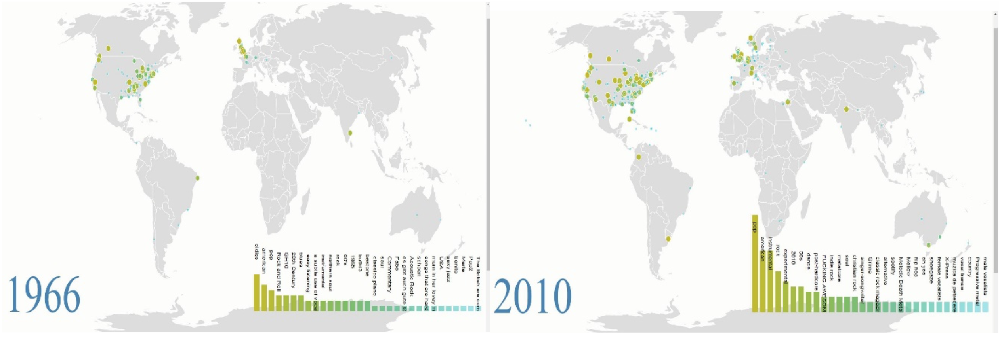

# 期末專案: 百萬歌曲分析

## 問題

我們想要觀察音樂的流行趨勢，並視覺化資料的結果和預測。

因此我們找了有百萬首歌以上的資料庫進行分析。

## 資料庫的描述

- 來自Amazon Public Dataset snapshot
- 放在Amazon AWS上的500GB資料集，需要透過Amazon EBS存放後再用Amazon EC2下載該資料集。
- 資料庫裡面含有歌曲名稱，歌詞，歌手資料，風格的標籤，歌手所在經緯度等。

## 分析工具

- Apache Spark 
- Anaconda
- Python
- MLlib
- D3.js
- Google API

## 分析方式

1. Amazon AWS存放資料，下載資料
2. Apache Spark整理資料，分析資料
3. html, css, javascript來視覺化分析結果
4. Google API來plot經緯度

## 結論

- 目前的資料集著重在歐美，而且歌曲數量仍不足以表現出流行趨勢的變動（無法做出有力的結論）。
- Google API還有從Amazon AWS處理這些資料時，免費的選擇可能下載超久或是額度不夠用。
- 很多歌曲的資料欄位仍然有缺失，在處理遺失資料的問題時，應該有更好的處理方法。

---

# Final Project: Million Song Dataset

## Target Problem

We wanted to observe the music trends around the world and try to visualize the
data to make some conclusion and prediction. Therefore, we found a million song
dataset and several relative datasets to do the work.

## Description of the datasets

- A collection of audio features and metadata for a million contemporary popular
music tracks, as our datasets to analyze. 
- The Million Song Dataset is also a cluster of complementary datasets containing cover songs, lyrics, user data, genre labels and song tags similarity contributed by the community.

## Analysis tools/languages

- Apache Spark 
- Anaconda
- Python
- MLlib
- D3.js
- Google API

## Analysis Result

We used html, css, javascript to visualize the data analysis result. From this webpage, we can clearly see the popularity of the song tags, for instance, language, style, singers etc. from 1924 to 2010.
Using Google api to acquire the exact coordinates of each location, and plot them on the map.

## Problems encountered

1. Some data were missing, made it difficult to analyze. If the data is more complete, we can do more works and predictions with it.
2. Google API only provides 2500 free accesses quota per day, we used many google accounts to accomplish this task with 24000 locations.
3. The information provided by last.fm which is very trivial, is in the json form with a million directories. We have to organize these data into a csv table with one million times IO. Therefore, we chose spark which can do multiple read-in tasks simultaneously. It took us 4.5 hours to finish the tasks with approximately 6x efficiency compared to running program on localhost.
4. The size of the data is still too small to make a strong conclusion.

## Future work

 Use Echo API to search for more complete global music dataset instead of current ones which mainly focused on Europe and America.

 ## Reference

[Million song dataset](http://labrosa.ee.columbia.edu/millionsong/)

How to get the dataset:

[如何從Amazon上處理資料](https://github.com/w22116972/2016spring_project/blob/master/BigData/How%20to%20download%20open%20dataset%20on%20Amazon.md)

[另一個資料來源](http://labrosa.ee.columbia.edu/millionsong/pages/gettingFdataset) 
 
[Additional datasets](http://labrosa.ee.columbia.edu/millionsong/pages/additional-datasets)

Thierry Bertin-Mahieux, Daniel P.W. Ellis, Brian Whitman, and Paul Lamere. 
The Million Song Dataset. In Proceedings of the 12th International Society
for Music Information Retrieval Conference (ISMIR 2011), 2011.
